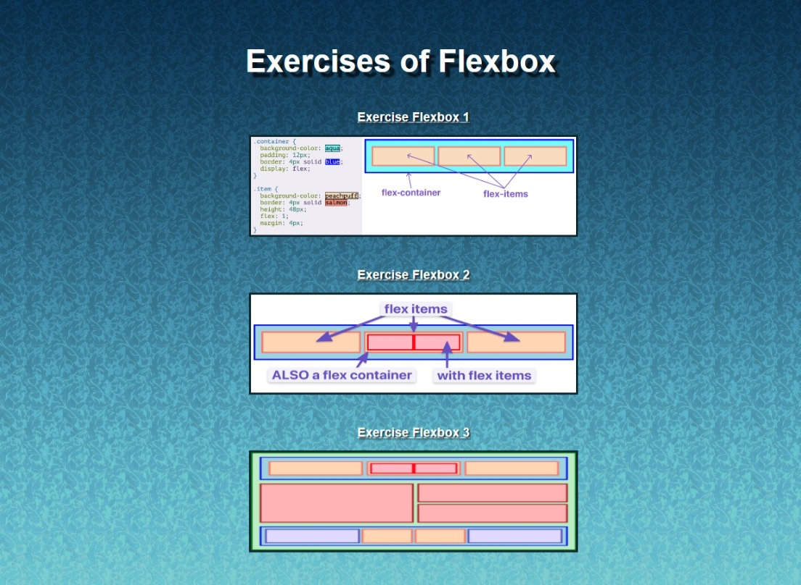

# Introduction to Flexbox - Exercises

> A section was created for the Odin Project exercises, specifically the three images related to Flexbox in the ‘Introduction to Flexbox’ section. For each of the exercises, HTML and CSS were used, with CSS being more prominent since each exercise required the use of Flexbox rules.

Additional description about the project and its features.

## Built With

- Major languages: HTML, CSS.
- Technologies used: Linux, Git bash.

## Live Demo

[Live Demo Link](https://vxnec0de.github.io/introduction_to_flexbox/)

## Getting Started

**Clone the repository in Git and run it from a browser.**

## Authors

👤 **Vanessa Carolina Rubio Cheing**

- GitHub: [@VxneC0de](https://github.com/VxneC0de)
- Instagram: [@v_rc20](https://www.instagram.com/v_rc20/)
- LinkedIn: [LinkedIn](https://www.linkedin.com/in/vanessa-rubio-7b7492293/)

## 🤝 Contributing

Contributions, issues, and feature requests are welcome!

Feel free to check the [issues page](https://github.com/VxneC0de/introduction_to_flexbox/issues).

## Show your support

Give a ⭐️ if you like this project!

## Acknowledgments

- Inspiration: https://www.theodinproject.com/lessons/foundations-introduction-to-flexbox

## 📝 License

This project is [CC0 1.0 Universal](LICENSE) licensed.